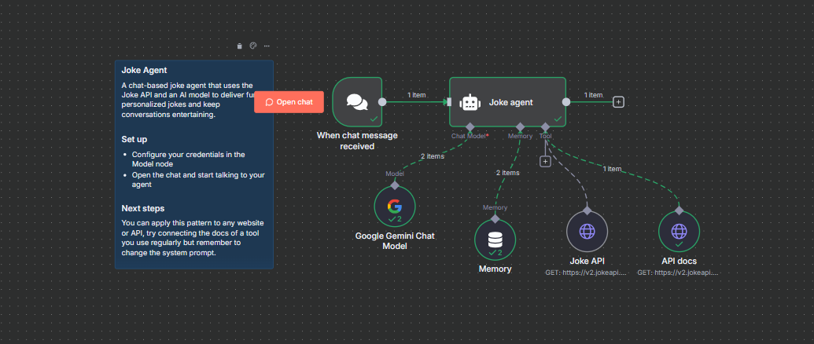

# 🤖 Joke Agent (with HTTP Tool)

A chat-based joke agent built with **n8n**, powered by **Google Gemini** and the [JokeAPI](https://v2.jokeapi.dev/).  
This agent listens to chat messages, fetches fresh jokes from the API, and delivers them in a fun and interactive way.  

---

## ✨ Features
- 📩 **Chat-triggered jokes** – responds whenever a chat message is received  
- 😂 **Multiple joke categories** – programming, puns, dad jokes, clean jokes, knock-knock, and more  
- 🔄 **Dynamic API calls** – integrates with [JokeAPI](https://v2.jokeapi.dev/) for real-time humor  
- 🧠 **Memory buffer** – remembers recent context to avoid repeating jokes  
- 🤝 **Customizable system prompt** – define the bot’s humor style & interaction rules  

---

## 📂 Project Structure
- **`Joke agent`** → Core AI agent that handles humor and responses  
- **`Joke API`** → Connects to [JokeAPI](https://v2.jokeapi.dev/joke/) for fetching jokes  
- **`API docs`** → Reads JokeAPI documentation for filtering and formatting  
- **`Memory`** → Stores recent conversation history  
- **`Google Gemini Chat Model`** → Provides natural, conversational delivery  
- **`When chat message received`** → Trigger node that starts the workflow  

---

## 🖼️ Workflow Overview

Below is a simplified view of the Joke Agent workflow:

